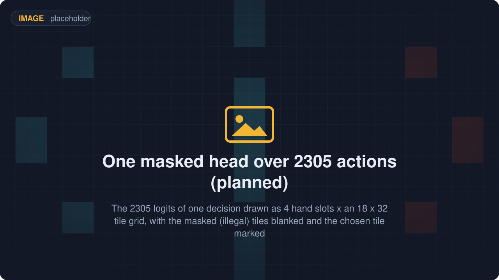

# RoyaleLearn

**Training for Clash Royale bots**: self-play rollouts over
[RoyaleGym](https://github.com/RoyaleGym/RoyaleGym) environments, a PPO learner for the game's
card-and-tile action space, and a ladder of frozen opponents that decides whether a new policy is
really stronger than the one before it. For people who train agents.

<p align="center"></p>

RoyaleLearn is the top of the Royale stack, the part that turns the environments into a trained
bot. Its design is settled and written down; the harness itself is not written yet. Everything it
will sit on runs today: a Rust battle engine that plays a whole match in under a second,
environments that hand a policy the exact set of legal moves, and a viewer that watches a training
run as it happens. This page shows what the harness will be, what runs now, and where the two meet.

## What it will do

<table>
  <tr>
    <td width="33%" align="center"><br><b>The environment it trains on, running today</b><br><sub>A self-play environment under a random policy, watched live in RoyaleViser at 30 frames a second.</sub></td>
    <td width="33%" align="center"><br><b>Rollout workers</b><br><sub>N battles step as one batch of 2N players, so one policy collects both sides' experience.</sub></td>
    <td width="33%" align="center"><br><b>One masked head over 2305 actions</b><br><sub>No-op, or one of 4 hand cards on one of 18 x 32 tiles; moves the game would refuse are masked out.</sub></td>
  </tr>
  <tr>
    <td width="33%" align="center"><br><b>A ladder of frozen opponents</b><br><sub>Past policies form a pool the learner is rated against; a snapshot joins when its win rate clears the gate.</sub></td>
    <td width="33%" align="center"><br><b>Checkpoints that reproduce</b><br><sub>Policy, critic, optimizer, pool and seeds in one file, so a resumed run lies on the original's curve.</sub></td>
    <td width="33%" align="center"><br><b>Metrics from both sides</b><br><sub>One Weights &amp; Biases run: steps per second and crowns from the environment, loss and Elo from the learner.</sub></td>
  </tr>
</table>

Five of the six tiles are planned, not built. Each of those five pieces will be an abstract base
class with a default implementation, so a rating scheme, a sampler or a metrics sink can be swapped
without forking the training loop.

## Try it

The harness is not written, but the surface it is built against is. After the install below
(`royalegym` with the engine built) this shows the batch a rollout worker will consume:

```python
from royalegym import ClashParallelEnv, ClashSelfPlayVecEnv
from royalegym.rust_engine import RustEngine

venv = ClashSelfPlayVecEnv(num_games=4, env_fn=lambda: ClashParallelEnv(RustEngine()))
obs, info = venv.reset(seed=0)

print(venv.num_envs)                            # both players of 4 battles, one batch
print(venv.single_action_space)
print({k: v.shape for k, v in obs.items()})
```

```
8
Discrete(2305)
{'action_mask': (8, 2305), 'mask_planes': (8, 4, 32, 18), 'spatial': (8, 20, 32, 18), 'vector': (8, 1177)}
```

Eight rows: two players per battle, both feeding one policy, each seeing its own king at the bottom.
`action_mask` marks each row's legal card-and-tile moves, 691 of 2305 on the first step. One step is
one decision, half a second of game time by default (`decision_ms`); waiting is the no-op. When a
battle ends its last observation goes to `infos["final_obs"]` and `infos["final_info"]`; its row
already holds the next one's first. With `ROYALEVISER=127.0.0.1:9870` set, another terminal's
`python -m royaleviser --stream 127.0.0.1:9870` watches the batch step; that made the still above.

The package itself imports without torch. The configuration tree, the run identity and the
rollout worker run on numpy and msgspec alone, which is what lets the config and identity
commands work in an environment where torch is not installed:

```
$ python -c "import royalelearn, sys; print(royalelearn.RunConfig, 'torch' in sys.modules)"
<class 'royalelearn.config.RunConfig'> False
```

Public names are resolved on first use, so a name that does need torch pays for it when it is
asked for, and raises an `ImportError` naming the package to install when it is missing.

## With the rest of the stack

<p align="center"></p>

RoyaleLearn is the top layer of five sibling repos, four of them public under the GitHub
organisation [RoyaleGym](https://github.com/RoyaleGym). It imports `royalegym` and nothing from the
engine directly, and dependencies run one way, RoyaleLearn to RoyaleGym to RoyaleSim. If you know
RLGym, RocketSim and RLGym-PPO, this is that split with the same names.

| Repo | What it is | To this repo |
|---|---|---|
| [RoyaleSim](https://github.com/RoyaleGym/RoyaleSim) | the battle engine: deterministic, integer-only Rust, its movement rules measured against recordings of real battles | the battle every rollout runs, reached only through RoyaleGym |
| [RoyaleGym](https://github.com/RoyaleGym/RoyaleGym) | the environment API: observations, actions, rewards; Gymnasium, PettingZoo and self-play envs | the environments the workers step, the legality mask the learner applies, and the opponent-pool bookkeeping the ladder will drive (`royalegym.selfplay.OpponentPool`: snapshots, uniform / latest / prioritised sampling, Elo, head-to-head records, save and load) |
| **RoyaleLearn** (this repo) | the training harness: self-play rollouts, PPO, a ladder of frozen opponents, checkpoints | the harness |
| [RoyaleViser](https://github.com/RoyaleGym/RoyaleViser) | the viewer: recordings, engine traces and running environments in its own window | a training run streams to it like any environment (`ROYALEVISER=host:port`, handled by `royalegym`), never through this repo |
| RoyaleLive | the private client instrument that records real battles | nothing directly: its recordings calibrate the engine, and a bot trained here is judged by its wins, not by its agreement with the engine |

What flows in: environments from RoyaleGym, with the engine build under them. What flows out:
policy snapshots and checkpoints (formats not fixed yet), a metrics stream, and one frame per env
step for a viewer that is listening.

```
mkdir Royale && cd Royale
git clone https://github.com/RoyaleGym/RoyaleSim.git
git clone https://github.com/RoyaleGym/RoyaleGym.git
git clone https://github.com/RoyaleGym/RoyaleViser.git
git clone https://github.com/RoyaleGym/RoyaleLearn.git
python -m venv .venv                                                    # Python 3.12
.venv\Scripts\python -m pip install maturin pytest hypothesis ruff
cd RoyaleSim && ..\.venv\Scripts\python tools\extract_arena.py && ..\.venv\Scripts\python tools\extract_cards.py && ..\.venv\Scripts\python tools\extract_globals.py && cd ..   # generates RoyaleSim/data/derived/
cd RoyaleSim && ..\.venv\Scripts\maturin develop --release && cd ..     # builds the engine into the venv (~1 min, ~1.5 GB RAM)
.venv\Scripts\python -m pip install -e RoyaleGym
.venv\Scripts\python -m pip install -e RoyaleViser
.venv\Scripts\python -m pip install -e RoyaleLearn
```

This repo needs the whole block, in that order: `royalelearn` declares `royalegym` as a dependency
and pip resolves it from the venv, never from PyPI. `pip install -e "RoyaleLearn[torch]"` adds
torch, which only the learner itself needs.

## Status (2026-09-21)

Working:

- The package imports in the workspace venv without torch, and resolves a name that needs it only
  when it is asked for (above).
- The pieces the harness is assembled from: the abstract base classes in `royalelearn/api/`, the
  configuration tree and its three machine profiles, the seed tree every random draw descends
  from, the run identity a resume is checked against, the environment spec read off a running
  environment, the shared-memory layout the workers and the learner meet in, and the metric
  schema. None of them needs torch.
- Everything below this repo: the environments, the mask, the same-step autoreset, seeding end to
  end, the opponent-pool bookkeeping and the viewer stream.

Open, which is the harness itself:

- Rollout workers over `ClashSelfPlayVecEnv`, Python first and Rust when they become the
  bottleneck. A Python observation builder measured in 2026-09 capped at about 520 env steps per
  second against roughly 25 000 engine ticks per second (a tick is the game's 50 ms step), so
  RoyaleGym's move of the default observation into the engine comes first.
- The PPO learner over `Discrete(2305)` with the mask on the logits; the ladder and its gate; the
  checkpoint format; the metrics sink. Nothing is wired to an environment yet.
- Deliberately no baseline learner, no throwaway trainer and no "simple version first": the layers
  below are finished to that standard, and a partial harness is not a milestone.
  [`docs/design.md`](docs/design.md) carries the reasoning and the conventions the harness is held to.

Tests:

```
cd RoyaleLearn && ..\.venv\Scripts\python -m pytest -q     # 478 passed, 9 slow (2026-09-22)
..\.venv\Scripts\ruff check .                              # All checks passed!
```

The tests are the import contract above, the configuration tree and its typo refusals, the seed
tree's pinned values, the identity hash field by field, the byte layout against a golden record,
and the environment spec read off a running `ClashSelfPlayVecEnv` on two card catalogues of
different widths, so that nothing in them can be a width copied out of one.

Read next: [`docs/design.md`](docs/design.md) (the five pieces, the metric, the conventions), then
the [RoyaleGym](https://github.com/RoyaleGym/RoyaleGym) README for the environments and the
[RoyaleSim](https://github.com/RoyaleGym/RoyaleSim) README for the engine.

## Community

Training runs, ladder results and harness design are discussed in the project's Discord:
[**https://discord.gg/4D2BS5JBHP**](https://discord.gg/4D2BS5JBHP)

Issues and pull requests on this repo are welcome too.

## Licence

MIT (`LICENSE`).
