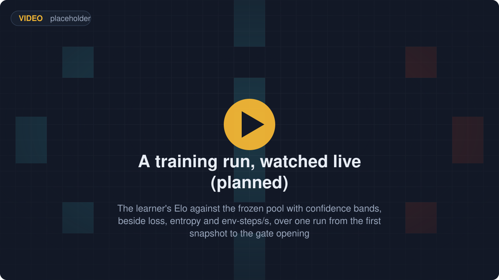
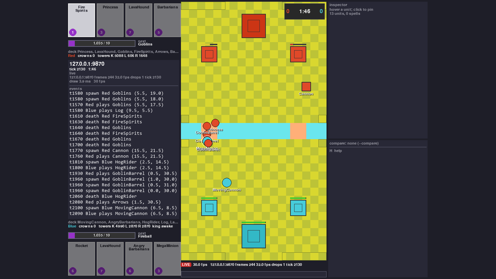
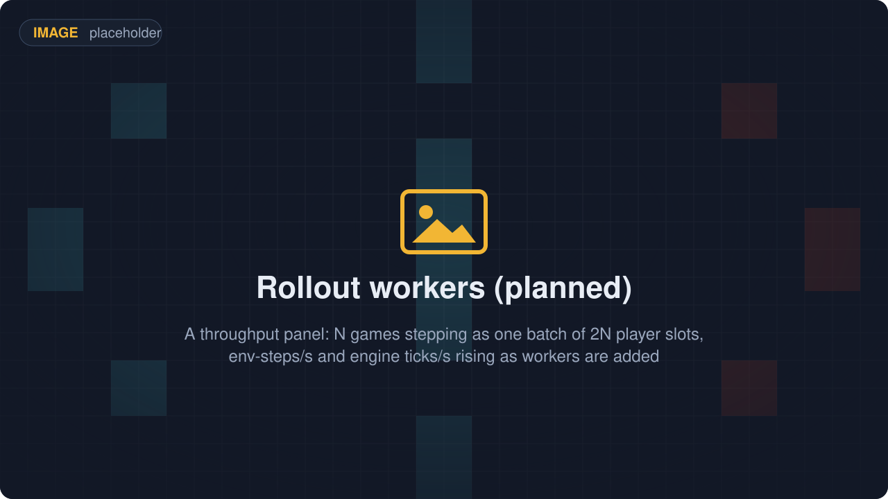
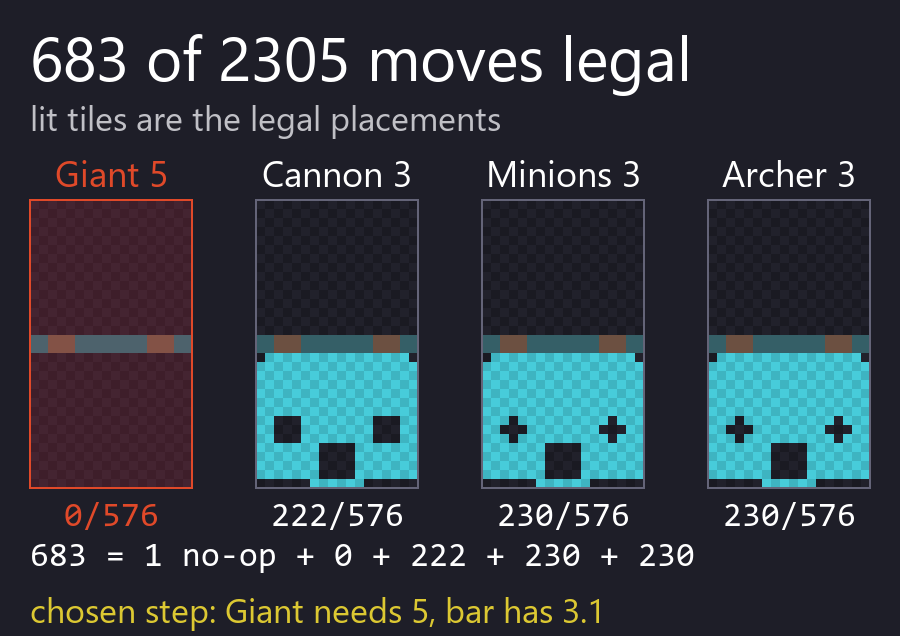
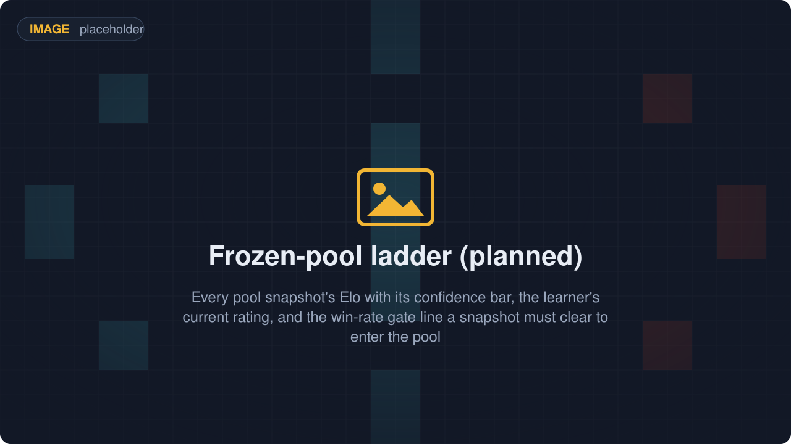
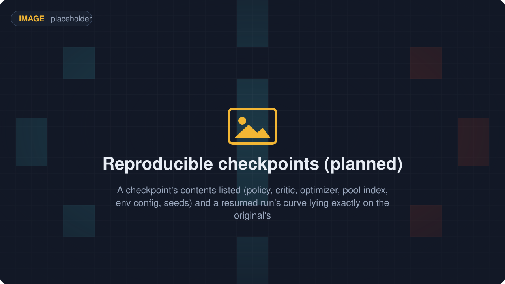
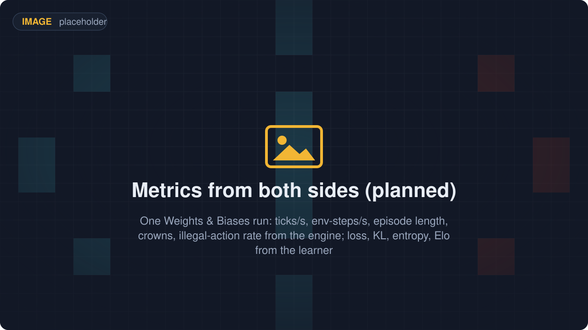
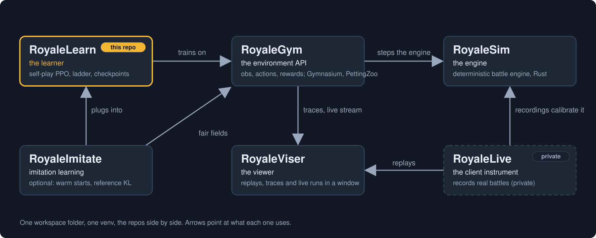

# RoyaleLearn

<p align="center">
  
  
  <a href="docs/"></a>
  <a href="https://discord.gg/4D2BS5JBHP"></a>
  
</p>

**This is the part that trains a Clash Royale bot.** You write a reward function, which is a small
piece of Python that scores what just happened in a battle. The bot plays itself over and over and
keeps what wins. A ladder of its own older versions decides whether the new bot is actually better
than the last one.

**You can start a run.** The training loop has worked since 2026-09-22 (commit 5685cad). One
command trains:

```
python -m royalelearn train --config examples\configs\smoke.json
```

Two things to know before you try it.

It needs torch, which is an extra rather than part of the plain install:
`pip install -e "RoyaleLearn[torch]"`. Skip it and `train`, `doctor` and `bench` all stop with
`ModuleNotFoundError: No module named 'torch'`. Everything else works without torch on purpose,
and the suite checks that it does.

And read `smoke.json` for what it is. It runs on `MockEngine`, the pure-Python stand-in engine,
with a limit of 96 timesteps. It proves the loop closes and it is not a training run. The run
above finished at iteration 3 and left a checkpoint carrying the network, the advantage scaler
and the ladder's pool. `laptop.json` and `workstation.json` are the real thing, on the Rust
engine with a limit of 100,000,000 timesteps. **The real profile runs, and nobody has trained
a bot with it.** Of those two files, only `laptop.json` has been run. The first two collection
rounds of one run on the maintainer's laptop:

```
collected     228 cycles, 32832 timesteps in 46.0s (951 env steps/s); updating
collected     228 cycles, 32832 timesteps in 19.0s (2305 env steps/s); updating
```

The first round of a run is always the slow one, because the workers are spawning and nothing
is warm. That is the variable to know about, more than your hardware. Across six measurements
on that laptop the first round came in at 46, 79 and 179 seconds, a spread of 3.9x, while every
round after it came in at 12.6, 13 and 19 seconds, a spread of 1.5x. Once a run is warm it is
fairly steady even on a busy machine. Wait for the second round before you believe any timing.

A complete iteration was measured at 518 and 544 seconds, so about nine minutes on an idle
machine. Read that with its settings attached: 2026-09-22, the laptop profile at a minibatch of
512, which is not the default any more. 256 is, because 512 does not fit a 4 GB card. Nobody has
timed a full laptop iteration at 256. It degrades badly under contention: one iteration sharing eight processors with a
second training run had still not finished after 46 minutes. A useful run is many hours.
Two complete iterations have happened, which is a loop that works rather than a result about
learning. Nobody knows yet whether a bot trained this way is any good, and the harness logs
`run/cumulative_timesteps` beside the rating so the first real run measures what it costs.

Everything else is here and tested, and runs today. The configuration tree, the run identity,
the networks, the observation codec, the rollout workers, the ladder, the metrics sinks and the
checkpoint store. So does the experience buffer, along with GAE, which is the arithmetic that
turns a finished battle into a score for each decision in it. So does everything underneath. A Rust battle engine plays a whole
match in under a second. Environments hand a bot the exact set of moves the game would allow. A
viewer draws a battle in its own window while it is being played.

<p align="center"></p>

## What you get

Six pieces, and all six run today.

<table>
  <tr>
    <td width="33%" align="center"><br><b>The environment it trains on</b><br><br><sub>A self-play environment under a random policy, watched live in RoyaleViser at 30 frames a second.</sub></td>
    <td width="33%" align="center"><br><b>Rollout workers</b><br><br><sub>N battles step as one batch of 2N players, so one bot collects both sides' experience.</sub></td>
    <td width="33%" align="center"><br><b>One masked head over 2305 actions</b><br><br><sub>No-op, or one of 4 hand cards on one of 18 x 32 tiles; moves the game would refuse are masked out.</sub></td>
  </tr>
  <tr>
    <td width="33%" align="center"><br><b>A ladder of frozen opponents</b><br><br><sub>Past policies form a pool the learner is rated against; a snapshot joins when its win rate clears the gate.</sub></td>
    <td width="33%" align="center"><br><b>Checkpoints that reproduce</b><br><br><sub>Policy, critic, optimizer, pool and seeds in one file, so a resumed run picks up where the original stopped.</sub></td>
    <td width="33%" align="center"><br><b>Metrics from both sides</b><br><br><sub>Steps per second and crowns from the environment, loss and rating from the learner, one row per iteration. They go to a file in your run folder and to the console. Weights and Biases is an optional extra and is off in every shipped config.</sub></td>
  </tr>
</table>

Running is not the same as trained. The masked head and the PPO update that trains it run end to
end, but nobody has trained a bot with them yet, so there is no evidence yet that they produce a
good one, and there is more to say than that. On 2026-09-22 we found that a reward reached the
buffer one cycle late, so it sat beside the action after the one that earned it. Every training
number this project had produced to that point described a different objective than the one we
meant. The fix landed the same evening (`87c97ae`), and nothing has been trained since, so the
honest position is that the loop is correct as far as we can tell and entirely unproven.

In plain words, for anyone who has not trained a bot before:

- **A rollout worker** is a separate process that just plays battles and writes down what happened.
  Both sides of a battle feed the same bot, so one battle gives you two players' worth of
  experience. There are two of them here: an in-process reference, and a farm of worker processes
  held byte for byte identical to it by a test.
- **A masked head** means the bot picks from 2305 choices. Those are the no-op, which is waiting,
  plus each of your 4 hand cards on each of 18 x 32 board tiles. Moves the game would refuse are
  blanked out before the bot chooses, so it never wastes a turn on an illegal play.
- **PPO** is the algorithm that nudges the bot toward the choices that scored well, in steps small
  enough that it does not throw away what it already knows.
- **A frozen opponent** is a copy of your bot saved at some earlier point and never trained again.
  Beating your own past selves is how you know you improved. A new copy only joins the pool when it
  beats the pool often enough.
- **A checkpoint** is one file holding everything needed to carry on: the bot, the critic that
  estimates how well it is doing, the optimizer, the pool and the random seeds. Resume from it and
  all of that comes back exactly. The one thing not restored is a battle that was half played
  when the file was written. It is not finished, and the next battle starts in its place.

Each of these is a base class with a default implementation, and you can replace any of them with
your own without editing the training loop. If you want a different rating scheme, a different way
of picking opponents, or your numbers sent somewhere new, you write your version and name it in
the config.

## What you can run today

You can see exactly what the training loop learns from, without torch. After the install below
(`royalegym` with the engine built), this prints the batch of players a rollout worker consumes:

```python
from royalegym import ClashParallelEnv, ClashSelfPlayVecEnv
from royalegym.rust_engine import RustEngine

venv = ClashSelfPlayVecEnv(num_games=4, env_fn=lambda: ClashParallelEnv(RustEngine()))
obs, info = venv.reset(seed=0)

print(venv.num_envs)                            # both players of 4 battles, one batch
print(venv.single_action_space)
print({k: v.shape for k, v in obs.items()})
```

```
8
Discrete(2305)
{'action_mask': (8, 2305), 'mask_planes': (8, 4, 32, 18), 'spatial': (8, 20, 32, 18), 'vector': (8, 1177)}
```

Eight rows, because four battles have two players each and both feed one bot. Each row sees its own
king tower at the bottom, so the bot never has to learn the board twice.

`action_mask` marks the legal card-and-tile moves for that row. How many are legal depends on
the deck and on what is in hand, and it differs between the two seats when their decks do: on
the first step with randomly dealt decks it was 691 for one seat and 1259 for the other.

One step is one decision, and a decision is half a second of game time by default. That is the
`decision_ms` setting. Waiting is a legal choice, and it is the no-op.

When a battle ends, its last observation goes to `infos["final_obs"]` and `infos["final_info"]`,
and that row already holds the first observation of the next battle. Nothing stalls.

To watch it, set `ROYALEVISER=127.0.0.1:9870` and run
`python -m royaleviser --stream 127.0.0.1:9870` in another terminal. That is how the picture at the
top left of the grid was made.

Those widths are not constants. Every shape, every width and every field's place in the vector is
read off the running environment when the harness starts, and none of them is typed into the code. The `1177` above
comes from the card catalogue this checkout built, and a checkout that built a different card table
prints a different number. The catalogue grew again recently and nothing in the code needed
editing. A page that quotes a vector width or a plane count as a fixed number is already wrong,
including this one if you read it that way.

The package installs and imports without torch, the machine learning library. The config tree, the
run identity and the rollout worker need only numpy and msgspec, so you can write and check a
config, and run the identity commands, on a machine that has no torch at all:

```
$ python -c "import royalelearn, sys; print(royalelearn.RunConfig, 'torch' in sys.modules)"
<class 'royalelearn.config.RunConfig'> False
```

Anything that does need torch pulls it in only when you ask for that name. If torch is missing
you get Python's own `ModuleNotFoundError: No module named 'torch'`, and the fix is the torch
line of the install below.

## What you type

All four of these work. `train` needs the torch extra; so do `doctor` and `bench`.

```
python -m royalelearn train --config examples/configs/laptop.json
python -m royalelearn config --profile laptop -o run.json      # writes a config to edit
python -m royalelearn doctor --config run.json                 # first-run checks
python -m royalelearn bench                                    # this machine's throughput
```

Start with the last two, not the first. `doctor` builds one environment, prints the engine build
digest and the observation shapes, checks the placement mask against the engine exhaustively,
prints the memory projection and refuses a run that will not fit. It takes seconds and catches
most first-run failures. `bench` measures your own machine's throughput instead of quoting
someone else's. It runs at least one whole training iteration, so on a real profile it takes as
long as one iteration does.

The config profiles are `laptop`, `workstation` and `many_core`. The first two also ship as files
in `examples/configs/`. `workstation.json` has not been run yet. Its minibatch, the number of
decisions the graphics card works through at once, is 2048, and nobody has measured it. If that
does not fit on your card, `train` stops at start-up and names a smaller value to use.

If you would rather edit Python than a command line, start from `examples/train_1v1.py`. It is a
short script: it loads `laptop.json`, changes a few fields such as the run name, then calls
`run.learn()` inside `with LearningCoordinator(config) as run:`. The command line and the script
go through the same object. Neither is a wrapper around the other.

On memory: the design budgets a laptop run at about 3.3 GB on a 7.8 GB machine. That figure is
arithmetic on paper, not a measurement of a running loop. `doctor` prints the same arithmetic
for your settings, next to how much memory is free right now. It refuses a run whose projection
goes over its memory budget, 6500 MB by default. The per-process figures inside the projection
come from the design, not from a measured run, so treat its total as an estimate.

### The reward function

This is the part you actually write. It lives in `royalelearn/rewards.py` and is composed in
`default_potential_reward()`. To change it you subclass `RewardFunction`, which is RoyaleGym's base
class, and name your class in the config's `env` block, so it is recorded in the checkpoint and in
the ladder's context like every other component. `examples/custom_reward.py` does exactly that.
It writes one new term, which scores having your units on the opponent's side of the river, adds
it to the others and names the result in the config. It also lists its own module in
`extra_component_modules`. Without that line the run refuses to load your code, and the error
says which setting to add it to. The reward is the other main thing a bot creator changes.

One warning, because it is the mistake a newcomer is most likely to make. Do not re-tune the
shipped weights. Every shaping term here is a difference of potentials, and that form is what makes
the terms unable to change which strategy is best. A weight you nudge every time you measure a new
behaviour is standing in for a term that is missing. Write the missing term instead.

## With the rest of the stack

<p align="center"></p>

You need four repos to train a bot, and all four are public, under the GitHub organisation
[RoyaleGym](https://github.com/RoyaleGym). RoyaleLearn is the top layer. It imports `royalegym`
and never reaches into the engine itself.
Dependencies run one way, from RoyaleLearn to RoyaleGym to RoyaleSim. If you know RLGym, RocketSim
and RLGym-PPO, this is the same split with the same names.

| Repo | What it is | To this repo |
|---|---|---|
| [RoyaleSim](https://github.com/RoyaleGym/RoyaleSim) | the battle engine: whole-number Rust that gives the same answer every time, with its movement rules measured against recordings of real battles | the battle every rollout runs, reached only through RoyaleGym |
| [RoyaleGym](https://github.com/RoyaleGym/RoyaleGym) | the environment API: observations, actions, rewards; Gymnasium, PettingZoo and self-play envs | the environments the workers step, the legality mask the learner applies, and the opponent-pool bookkeeping the ladder drives (`royalegym.selfplay.OpponentPool`: snapshots, uniform / latest / prioritised sampling, Elo, head-to-head records, save and load) |
| **RoyaleLearn** (this repo) | the training harness: self-play rollouts, PPO, a ladder of frozen opponents, checkpoints | the harness |
| [RoyaleViser](https://github.com/RoyaleGym/RoyaleViser) | the viewer: recordings, engine traces and running environments in its own window | a training run streams to it like any environment (`ROYALEVISER=host:port`, handled by `royalegym`), never through this repo |
| RoyaleLive | the client instrument that records ground-truth traces from the real game. It is private, and so are its recordings | nothing directly: its traces calibrate the engine, and a bot trained here is judged by the matches it wins, not by how closely it agrees with the engine |

What comes in: environments from RoyaleGym, with the engine build under them. What goes out: bot
snapshots and checkpoints, in formats that are not fixed yet, a stream of numbers you can plot, and
one frame per env step for a viewer if one is listening.

### Install

```
mkdir Royale && cd Royale
git clone https://github.com/RoyaleGym/RoyaleSim.git
git clone https://github.com/RoyaleGym/RoyaleGym.git
git clone https://github.com/RoyaleGym/RoyaleViser.git
git clone https://github.com/RoyaleGym/RoyaleLearn.git
python -m venv .venv                                                    # Python 3.12
.venv\Scripts\python -m pip install maturin pytest hypothesis ruff
cd RoyaleSim && ..\.venv\Scripts\python tools\extract_arena.py && ..\.venv\Scripts\python tools\extract_cards.py --vintage 2018 && ..\.venv\Scripts\python tools\extract_cards.py --vintage 2018 --out data\derived\cards.json && ..\.venv\Scripts\python tools\extract_globals.py && cd ..   # generates RoyaleSim/data/derived/
cd RoyaleSim && ..\.venv\Scripts\maturin develop --release && cd ..     # builds the engine into the venv. Give it a few minutes and some free memory.
.venv\Scripts\python -m pip install -e RoyaleGym
.venv\Scripts\python -m pip install -e RoyaleViser
.venv\Scripts\python -m pip install -e RoyaleLearn
.venv\Scripts\python -m pip install -e "RoyaleLearn[torch]"   # only if you want to train; it is a big download
```

Run the whole block, in that order. This repo needs it. `royalelearn` lists `royalegym` as a
dependency and pip takes it from your venv, never from PyPI. If you want torch as well, use
`pip install -e "RoyaleLearn[torch]"`. Only the learner itself needs it.

## Status (2026-09-22)

<p align="center">
  
  
  
  
</p>

What works:

- The configuration tree with its three machine profiles, the seed tree every random draw comes
  from, and the run identity a resume is checked against.
- The training loop: the `train` command, the coordinator that collects, updates, rates and
  saves, and the PPO update itself.
- The networks, the observation codec, the experience buffer and GAE.
- The rollout workers: an in-process reference, and a farm of worker processes held byte for byte
  identical to it.
- The ladder, the metrics sinks and the checkpoint store.
- The swappable base classes in `royalelearn/api/`, the environment description read off a running
  environment, the shared-memory layout the workers and the learner meet in, and the metric schema.
- The package imports without torch, and pulls torch in only for the parts that need it. Shown
  above.
- Everything below this repo. The environments, the mask, the same-step autoreset, seeding from end
  to end, the opponent-pool bookkeeping and the viewer stream.

What is open:

- A bot. Every run so far has been a short test rather than real training, so there is no
  evidence yet about whether a policy trained here is any good.
- Rollout workers are Python today, and move to Rust when Python becomes the slow part. Here is why
  that order. A tick is 50 ms of game time, and the engine does roughly 25,000 of them a second. A
  Python observation builder measured in 2026-09 capped out at about 520 env steps a second, so
  Python, not the engine, is what you would be waiting for. RoyaleGym's planned move of the default
  observation into the engine comes first.
- There is deliberately no baseline learner, no throwaway trainer and no simple version first. The
  layers below are finished to a high standard, and a partial harness is not a milestone.
  [`docs/design.md`](docs/design.md) has the reasoning and the rules the harness is held to.

Tests:

```
cd RoyaleLearn && ..\.venv\Scripts\python -m pytest -q     # 616 passed, 20 deselected, with torch installed, on 2026-09-22
..\.venv\Scripts\ruff check .                              # All checks passed!
```

That run took 136 seconds on a laptop. The 20 deselected tests are left out by default so the
run stays short. They are the slow ones and the ones that need an engine build matching
RoyaleSim's data files. Adding `-m ""` to the pytest line runs them too. Without torch, the tests
that need it are skipped rather than failed, and everything else still runs.

They cover every piece listed above: the import contract, the config tree and its refusal of
typos, the seed tree's pinned values, the identity hash field by field, the byte layout against a
stored golden record, the experience buffer and its scoring, the checkpoint store and resume, the
ladder and its gate, the metrics, the networks and the PPO update.

One of them is worth singling out. The environment description is read off a running
`ClashSelfPlayVecEnv` on two card catalogues of different widths. The two catalogues are the
point. If a width had been copied into the code from one of them, the other would fail.

Read next: [`docs/design.md`](docs/design.md) for the pieces, the metric and the rules. Then the
[RoyaleGym](https://github.com/RoyaleGym/RoyaleGym) README for the environments and the
[RoyaleSim](https://github.com/RoyaleGym/RoyaleSim) README for the engine.

## Community

Training runs, ladder results and harness design are discussed in the project's Discord:
[**https://discord.gg/4D2BS5JBHP**](https://discord.gg/4D2BS5JBHP)

Issues and pull requests on this repo are welcome too.

## Licence

MIT (`LICENSE`).
